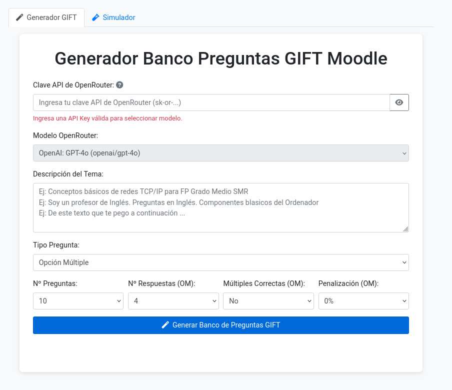
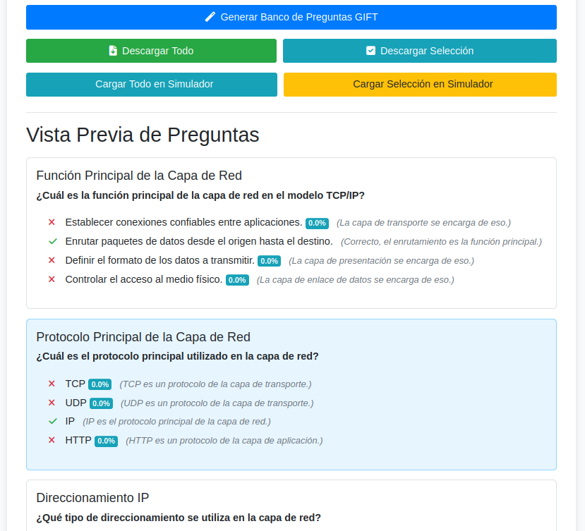

# Generador y Simulador Banco Preguntas GIFT Moodle (OpenRouter Dinámico)
[](https://github.com/soyunomas/GeminiGiftGenerator/blob/main/LICENSE) <!-- Asume que la URL de licencia no cambia -->
[](https://soyunomas.github.io/GeminiGiftGenerator/index.html) <!-- Actualiza si la URL de demo cambia -->

Herramienta integrada en un único archivo HTML que combina dos funcionalidades principales mediante pestañas:

1.  **Generador GIFT:** Crea bancos de preguntas en formato **GIFT** (Opción Múltiple y Verdadero/Falso) para **Moodle**, utilizando diversos modelos de IA accesibles a través de la **API de OpenRouter**.
2.  **Simulador GIFT:** Carga archivos `.gift` (o preguntas generadas) y permite responderlas en una interfaz similar a Moodle, con corrección detallada y cálculo de puntuación (incluyendo penalizaciones).

¡Descarga el archivo `index.html` y úsalo directamente en tu navegador!

*Puedes probar una demostración en vivo aquí: [Link a Demo en Vivo](https://soyunomas.github.io/GeminiGiftGenerator/index.html)* <!-- Actualiza si la URL de demo cambia -->

## Capturas de Pantalla
* Interfaz de usuario generador de preguntas:


* Detalle de preguntas generadas con posibilidad de seleccionar las que queramos para luego descargarlas:


* Interfaz de usuario simulador:


* Detalle de valoración del simulador:


## Características Principales

### General
*   **Interfaz Unificada con Pestañas:** Accede al Generador y al Simulador fácilmente desde la misma página.
*   **Archivo Único:** Todas las funcionalidades están contenidas en `index.html`. No requiere instalación ni servidor (solo navegador moderno y conexión a internet).
*   **Diseño Responsivo:** Interfaz adaptable gracias a Bootstrap.

### Generador GIFT (Pestaña "Generador GIFT")
*   **Generación Automática con IA:** Crea preguntas GIFT utilizando diversos modelos de IA a través de la API de **OpenRouter**.
*   **Tipos de Pregunta:** Soporta la generación de preguntas de **Opción Múltiple** y **Verdadero/Falso**.
*   **Conexión API Segura:** Requiere una clave API de **OpenRouter** (formato `sk-or-...`), con opción de mostrar/ocultar.
*   **Selección de Modelo Dinámica (OpenRouter):** Permite elegir entre una amplia gama de modelos ofrecidos por OpenRouter (GPT, Claude, Gemini, Llama, Mistral, etc.). La lista se carga **dinámicamente** desde la API de OpenRouter al inicio.
*   **Configuración Flexible:**
    *   Define el **tema** o descripción del contenido.
    *   Selecciona el **número de preguntas**.
    *   Elige el **tipo de pregunta**.
    *   **Opciones Condicionales (Opción Múltiple):** Nº de respuestas, Múltiples Correctas (con puntuación parcial), Penalizaciones configurables.
*   **Vista Previa Interactiva:** Muestra las preguntas generadas, permite seleccionar las deseadas y marca visualmente errores de formato GIFT.
*   **Descarga Fácil:** Botones para descargar **todas** las preguntas o solo las **seleccionadas** en formato `.gift`.
*   **Integración con Simulador:** Botones para **cargar directamente** las preguntas generadas (todas o selección) en la pestaña del Simulador para probarlas inmediatamente.
*   **Feedback al Usuario:** Indicadores de carga (generación y carga de modelos) y mensajes de error claros.

### Simulador GIFT (Pestaña "Simulador")
*   **Carga de Archivos:** Sube archivos `.gift` o `.txt` mediante selección o arrastrar y soltar (drag & drop).
*   **Parseo GIFT:** Interpreta preguntas de Opción Múltiple (simple/múltiple) y Verdadero/Falso, incluyendo feedback y porcentajes de puntuación/penalización.
*   **Interfaz tipo Moodle:** Presenta las preguntas de forma familiar.
*   **Interactividad:** Permite seleccionar respuestas (radio/checkbox) con feedback visual inmediato del estado ("Sin responder", "Respuesta guardada").
*   **Corrección Detallada:** Evalúa las respuestas al pulsar "Enviar Intento y Corregir", mostrando feedback específico por opción y general por pregunta.
*   **Cálculo de Puntuación Avanzado:** Considera puntuaciones parciales y **penalizaciones** configuradas en el formato GIFT para calcular la nota.
*   **Resultados Completos:**
    *   Muestra puntuación total, porcentaje y **nota sobre 10**.
    *   Presenta un **cálculo detallado (colapsable)** mostrando cómo se obtuvo la puntuación de cada pregunta (incluyendo valores positivos y negativos antes de limitar).
    *   Desglose de preguntas correctas, parcialmente correctas, incorrectas y sin responder.
    *   Fecha y hora de finalización.
*   **Repetir Intento:** Permite volver a realizar el mismo cuestionario cargado sin necesidad de subir el archivo de nuevo.

## Tecnologías Utilizadas

*   **HTML5:** Estructura semántica.
*   **CSS3:** Estilos personalizados.
*   **Bootstrap 4.5.2:** Framework CSS (incluye Tabs, Collapse, etc.).
*   **Font Awesome 6.0.0:** Iconos.
*   **JavaScript (ES6+):** Lógica del cliente, interacción API, manipulación DOM, generación/parseo GIFT, cálculo de puntuación, lógica de UI.
    *   `fetch`, `async/await`.
    *   `FileReader`, `Blob`.
    *   IIFE (Immediately Invoked Function Expressions) para encapsular scripts.
*   **OpenRouter API:** Gateway externo para IA generativa (generación de texto y listado de modelos).
*   **Dependencias JS de Bootstrap:**
    *   jQuery 3.5.1 Slim
    *   Popper.js 2.5.3

## Instalación / Visualización

Este proyecto es un único archivo HTML estático.

1.  **Clona o descarga el repositorio:**
    *(Actualiza la URL si el repositorio ha cambiado)*
    ```bash
    git clone https://github.com/soyunomas/GeminiGiftGenerator
    ```
    O descarga el archivo `index.html` directamente.
2.  **Navega al directorio (si clonaste):**
    *(Actualiza el nombre del directorio si ha cambiado)*
    ```bash
    cd GeminiGiftGenerator
    ```
3.  **Abre el archivo `index.html` en tu navegador web moderno.**

**¡Importante!** Se requiere **conexión a internet** para:
*   Cargar Bootstrap y Font Awesome desde CDNs.
*   Realizar llamadas a la **API de OpenRouter** (en la pestaña Generador, tanto para listar modelos como para generar preguntas).

## Uso

1.  Abre `index.html`. Verás dos pestañas: "Generador GIFT" y "Simulador".

### Para Generar Preguntas:
1.  Permanece en la pestaña "**Generador GIFT**".
2.  Ingresa tu **Clave API de OpenRouter** (debe empezar por `sk-or-...`).
3.  Espera a que la lista de **Modelos OpenRouter** se cargue (verás un indicador) y selecciona el que desees usar. El selector se habilitará automáticamente una vez que la API Key sea válida y los modelos estén cargados.
4.  Escribe una **Descripción del Tema**.
5.  Configura el **Tipo de Pregunta**, Nº de Preguntas y otras opciones si aplica.
6.  Haz clic en "**Generar Banco de Preguntas GIFT**".
7.  Revisa la **Vista Previa**. Selecciona las preguntas deseadas haciendo clic sobre ellas.
8.  Usa los botones:
    *   "**Descargar Todo**" / "**Descargar Selección**" para guardar el archivo `.gift`.
    *   "**Cargar Todo en Simulador**" para enviar todas las preguntas generadas a la otra pestaña.
    *   "**Cargar Selección en Simulador**" para enviar solo las preguntas seleccionadas. Al pulsar uno de estos, la interfaz cambiará automáticamente a la pestaña "Simulador".

### Para Simular un Cuestionario:
1.  Ve a la pestaña "**Simulador**".
2.  **Opción A (Archivo):** Carga un archivo `.gift` o `.txt` usando "Seleccionar Archivo" o arrastrándolo a la zona designada.
3.  **Opción B (Desde Generador):** Usa los botones "Cargar..." en la pestaña Generador.
4.  Responde las preguntas presentadas. El estado cambiará a "Respuesta guardada".
5.  Haz clic en "**Enviar Intento y Corregir**".
6.  Revisa los resultados: puntuación, nota sobre 10, desglose.
7.  Haz clic en el botón <i class="fas fa-chevron-down"></i> junto a "Detalle del Cálculo" para ver cómo se obtuvo la puntuación de cada pregunta, incluyendo penalizaciones.
8.  Usa "**Repetir Cuestionario**" para volver a intentarlo o "**Cargar Otro Archivo**" para empezar de nuevo (esto te devolverá a la pantalla de carga).

## Pre-configurar API Key (Opcional y Desaconsejado)

Aunque es posible modificar el archivo `index.html` para incrustar una clave API directamente en el código JavaScript, **se desaconseja encarecidamente por motivos de seguridad**. La forma recomendada y segura es que cada usuario introduzca su propia clave API en el campo de texto de la interfaz (`id="openrouter-api-key"`).

**¡Advertencia de Seguridad Importante!** ⚠️

> Incrustar tu clave API de OpenRouter directamente en el código HTML/JavaScript significa que **cualquier persona que tenga acceso al archivo podrá verla**. **NO subas este archivo con tu clave API personal a un repositorio público (como GitHub)**, ya que expondrías tu clave y podrías incurrir en costes si alguien la utiliza indebidamente. Esta opción solo debería considerarse para uso estrictamente personal y local, donde tienes control total sobre quién accede al código fuente. **Utiliza el campo de entrada de la API Key en la interfaz para mayor seguridad.**

## Licencia

Este proyecto está bajo la Licencia MIT. Consulta el archivo `LICENSE` para más detalles.
